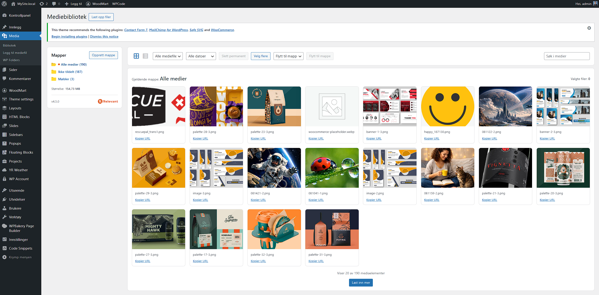
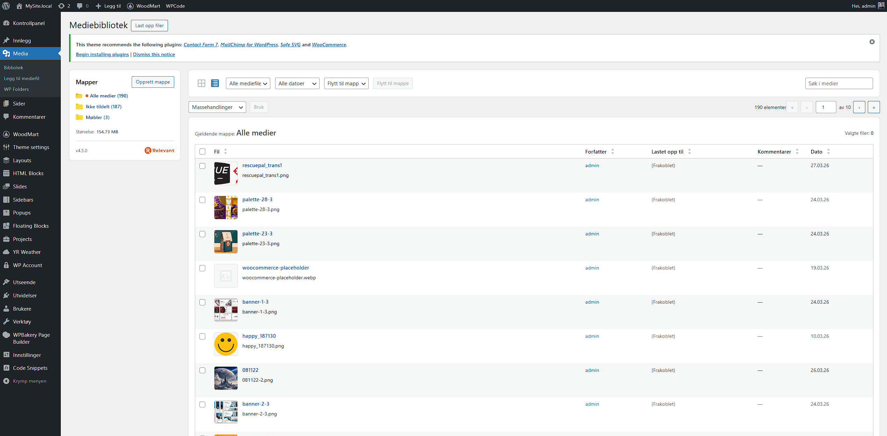
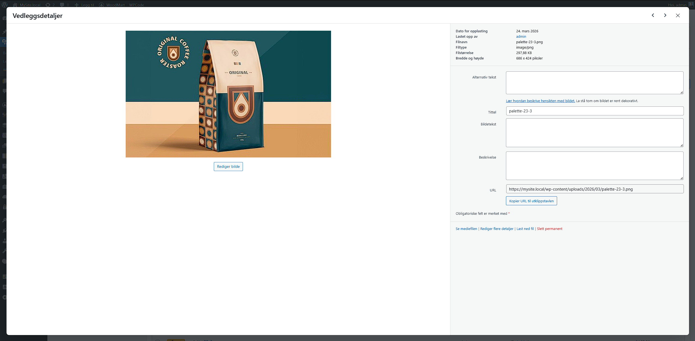
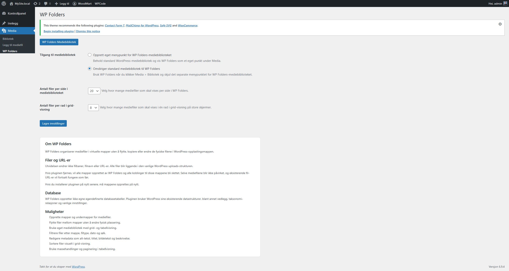

# WP Folders

WP Folders adds virtual folders and subfolders to the WordPress Media Library without changing the physical file paths in `uploads`.

The plugin does not move, rename, or copy files on disk. It only stores relationships between WordPress attachments and virtual folders.

## Screenshots

### Main Library

### Grid View

### List View

### Attachment Modal

### Settings

## Installation

1. Use the standard plugin installation or copy the plugin folder into `wp-content/plugins/`.
2. Make sure the structure looks like this:
3. Log in to the WordPress admin panel.
4. Go to `Plugins`.
5. Activate `WP Folders`.
6. After activation open:
   `Media -> WP Folders`

## What The Plugin Does

- Creates virtual folders for media files.
- Supports nested folders and subfolders.
- Works on top of standard WordPress attachments.
- Does not change the physical file location in `uploads`.
- Does not change existing file URLs.

## Main Features

- Create folders and subfolders for media files.
- Move files between folders without changing their physical location.
- Separate WP Folders media library with grid and list view.
- Filter files by folder, type, date, and search.
- Upload files directly into the current folder.
- Edit attachment metadata:
  alt text, title, caption, description.
- Copy file URL to clipboard.
- View attachment details in a modal window.
- Visual file sorting in grid view.
- Table mode with bulk actions and pagination.
- Column sorting in list view.
- Display total media library size.
- Support for unassigned files.

## Library Overview

In the WP Folders library the following features are available:

- Left panel with folder tree.
- Root state `All Media`.
- Separate state `Unassigned`.
- Create root folder.
- Create subfolder.
- Rename folder.
- Delete folder.
- Count files in folders.
- Display total media library size.

## Uploading Files

- The `Upload files` button opens the upload panel.
- Drag-and-drop area available.
- Files can be selected via the system file picker.
- If a specific folder is open, new files can be assigned to it immediately.
- After upload, the library updates automatically.

## Grid View

- File cards with preview.
- Select one or multiple files.
- Visual drag-and-drop ordering.
- `Select multiple` button.
- Bulk move to another folder.
- Bulk delete.
- Clicking a card opens the details modal.

## List View

- Table view of files.
- Columns:
  File, Author, Uploaded to, Comments, Date.
- Column sorting.
- Bulk actions.
- Pagination.
- Select all for current page.
- Row quick actions:
  edit, delete permanently, view, copy URL, download.

## Filters And Search

WP Folders supports:

- Media file search.
- Filter by file type.
- Filter by date.
- Filter by folder.
- Selection `All media files`.
- Selection `All dates`.
- System states:
  `Unattached`, `Mine`, `Unassigned`.

## Attachment Modal

The file details modal includes:

- Image preview or file icon.
- File name.
- MIME type.
- File size.
- Image dimensions if available.
- File URL.
- Copy URL button.
- Alt text.
- Title.
- Caption.
- Description.
- Navigation between previous and next items.

## Settings

The plugin has a separate settings page:

`Media -> WP Folders`

### 1. Media Library Access

Configures how the WP Folders library is accessed.

Available options:

- `Create separate menu item for the WP Folders media library`
  Keeps the standard WordPress Media Library unchanged and shows WP Folders as a separate menu item in the `Media` section.

- `Redirect the standard Media Library to WP Folders`
  Redirects the standard `Media -> Library` screen to WP Folders and removes the separate WP Folders menu item.

### 2. Media Library Items Per Page

Defines how many files to display per page in the WP Folders library.

Available values:

- `20`
- `50`
- `100`

### 3. Files Per Row In Grid View

Defines how many files to display per row in grid view on large screens.

Available values:

- `5`
- `6`
- `7`
- `8`
- `9`
- `10`

## Files, URLs And Database

Important points about how the plugin works:

- The plugin does not change file paths.
- The plugin does not change file names.
- The plugin does not change file URLs.
- Files remain in the standard WordPress uploads structure.
- The plugin does not create its own database tables.
- Standard WordPress data structures are used to store the structure:
  attachments, taxonomy relationships, options.

## What Happens If The Plugin Is Removed

- All created WP Folders folders will be deleted.
- All file-to-folder relationships will be removed.
- Media files themselves are not deleted.
- Physical files in `uploads` are not deleted.
- Existing file URLs continue to work.
- If the plugin is installed again later, folders will need to be recreated.
